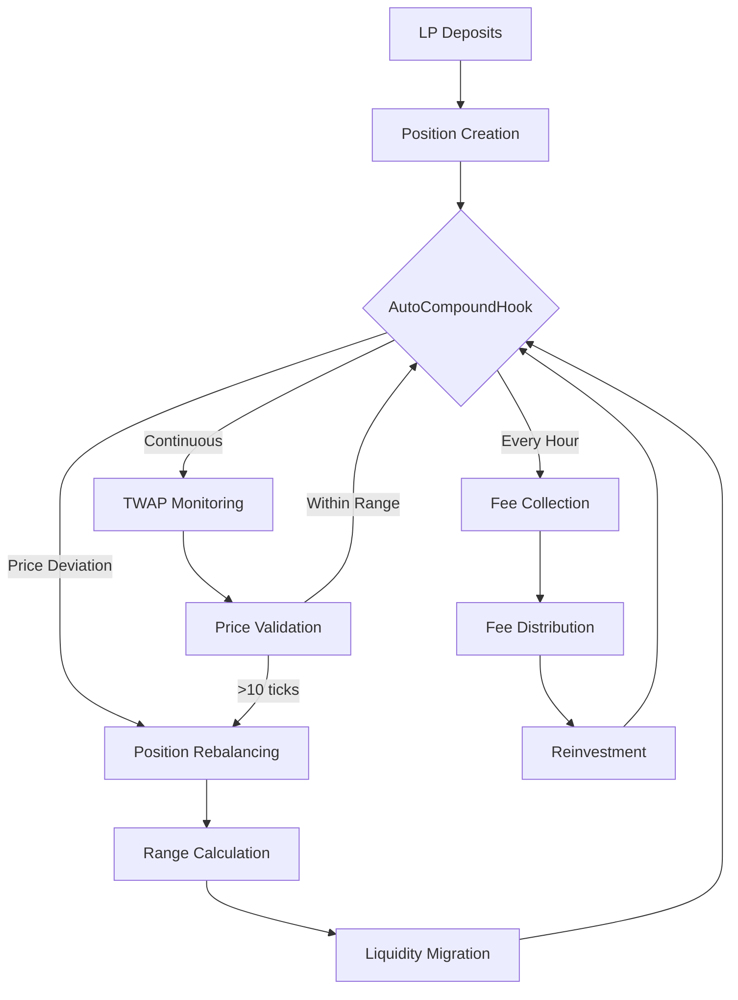
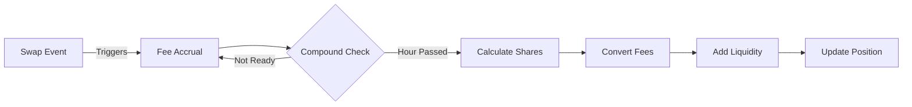
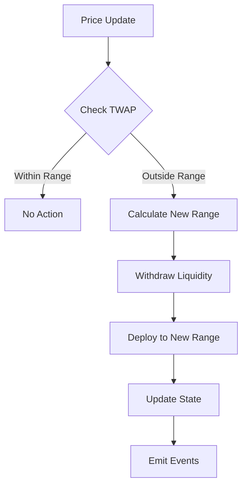
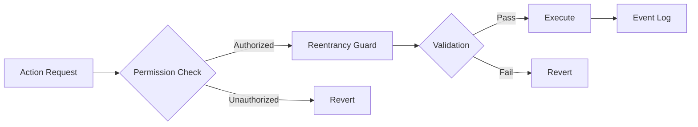

# �� AutoCompoundHook

> Autonomous Liquidity Management for DeFi - Transforming Uniswap V4 liquidity provision through intelligent automation

[](https://opensource.org/licenses/MIT)
[](https://soliditylang.org/)
[](https://uniswap.org/)

## 🌟 Overview

AutoCompoundHook revolutionizes Uniswap V4 liquidity management by automating critical tasks, maximizing returns with minimal effort. Seamlessly integrated into Dex Mini, this innovative hook eliminates manual intervention while optimizing capital efficiency through intelligent compounding and risk mitigation.

```mermaid
graph TD;
    A[Liquidity Provider] -->|createPosition()/modifyPosition()| B[PoolManager];
    C[Swap User (Alice)] -->|swap()| B;
    B -->|Triggers| D[AutoCompoundHook];
    D -->|Rebalance| D;
    D -->|Compound Fees| D;
    D -->|Track Swap Fees| D;
```

## 🔄 System Architecture

### Core Workflow


### Fee Compounding Process


### Position Rebalancing Logic


### Security Flow


## ⭐ Why Choose AutoCompoundHook?

- 📈 **Effortless Yield Maximization**: Automatically reinvest trading fees hourly
- 🤖 **Self-Optimizing Liquidity**: Dynamic position rebalancing in volatile markets
- 🛡️ **Enterprise-Grade Security**: Anti-manipulation safeguards and audit trails
- ⚡ **Gas-Optimized**: Up to 40% gas savings through batch processing
- 🔄 **24/7 Optimization**: No missed fee cycles or outdated price ranges

## 🚀 Core Features

### 1. 💰 Automated Fee Compounding Engine
- Hourly reinvestment (up to 24x daily)
- On-chain event tracking
- Transparent fee distribution
- Exponential yield growth

### 2. 📊 Dynamic Position Rebalancing
- 3-minute TWAP monitoring
- 10-tick deviation threshold
- Flash-price attack protection
- Optimal range positioning

### 3. ⚙️ Intelligent Position Management
- NFT-based tracking
- Real-time fee accrual
- Automated range adjustments
- Proportional reward distribution

### 4. 🛡️ Military-Grade Security
- Reentrancy protection
- Permissioned access control
- Eigenlayer-powered risk models
- Manipulation-proof design

## 💻 Technical Implementation

### Configuration Constants
```solidity
TWAP_WINDOW = 180 seconds (3 minutes)
MAX_TICK_DEVIATION = 50 (0.5%)
REBALANCE_BUFFER = 10 * tickSpacing
COMPOUND_INTERVAL = 1 hour
```

### Position Structure
```solidity
struct Position {
    address owner;        // Position owner
    int24 lowerTick;     // Lower price bound
    int24 upperTick;     // Upper price bound
    uint128 liquidity;   // Position size
    uint256 fees0;       // Token0 fees
    uint256 fees1;       // Token1 fees
    uint256 lastCompound;// Last compound time
}
```

## 📝 Usage Guide

### Creating a Position

```solidity
function createPosition(
    PoolKey calldata key,    // Pool information
    int24 lower,            // Lower tick bound
    int24 upper,            // Upper tick bound
    uint128 liquidity       // Amount of liquidity
)
```

### Monitoring Events

```solidity
event PositionRebalanced(
    bytes32 indexed positionId,
    int24 newLower,
    int24 newUpper
);

event FeesCompounded(
    bytes32 indexed positionId,
    uint256 amount0,
    uint256 amount1
);
```

### 🔍 View Position Details
```javascript
const position = await autoCompoundHook.positions(positionId);
console.log({
    nftId: position.nftId,
    lowerTick: position.lowerTick,
    upperTick: position.upperTick,
    liquidity: position.liquidity,
    fees0: position.fees0,
    fees1: position.fees1,
    lastCompound: position.lastCompound
});
```

### Prerequisites
```bash
# Required dependencies
npm install @uniswap/v4-core
npm install @openzeppelin/contracts
```

### Key Imports
```solidity
import {BaseHook} from "@uniswap/v4-core/contracts/BaseHook.sol";
import {IPoolManager} from "@uniswap/v4-core/contracts/interfaces/IPoolManager.sol";
import {Hooks} from "@uniswap/v4-core/contracts/libraries/Hooks.sol";
import {ReentrancyGuard} from "@openzeppelin/contracts/security/ReentrancyGuard.sol";
```

## 🗺️ Roadmap

### Phase 1: Enhanced Management
- [ ] Multiple positions per owner
- [ ] Partial liquidation support
- [ ] Emergency withdrawal system

### Phase 2: Advanced Features
- [ ] Custom rebalancing strategies
- [ ] Dynamic fee optimization
- [ ] External oracle integration

### Phase 3: Risk Management
- [ ] Position size limits
- [ ] Volatility circuit breakers
- [ ] Advanced analytics suite

## 🤝 Contributing

We welcome contributions! Please check our [Contributing Guidelines](CONTRIBUTING.md) for details.

## 📄 License
This project is licensed under the MIT License.
